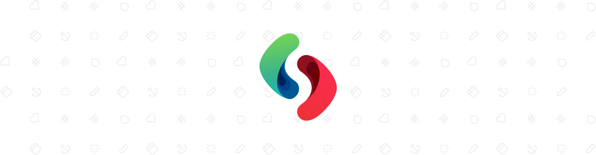
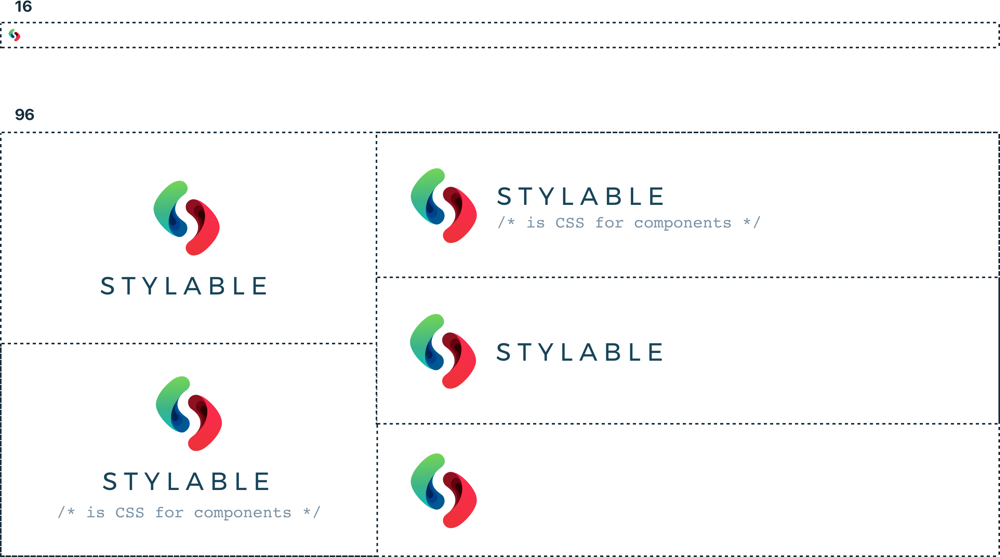
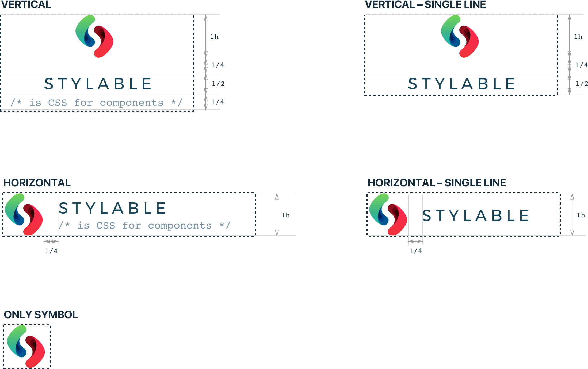
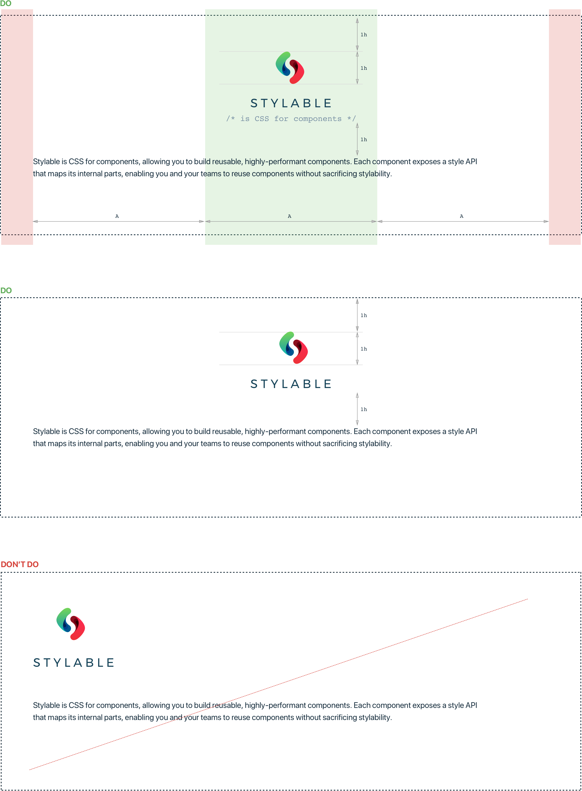
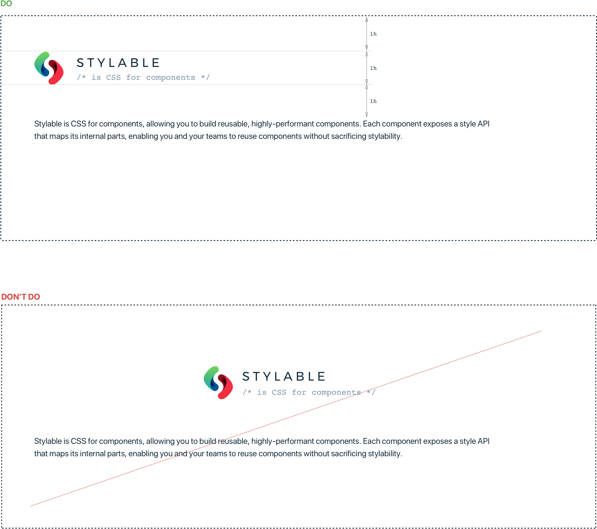
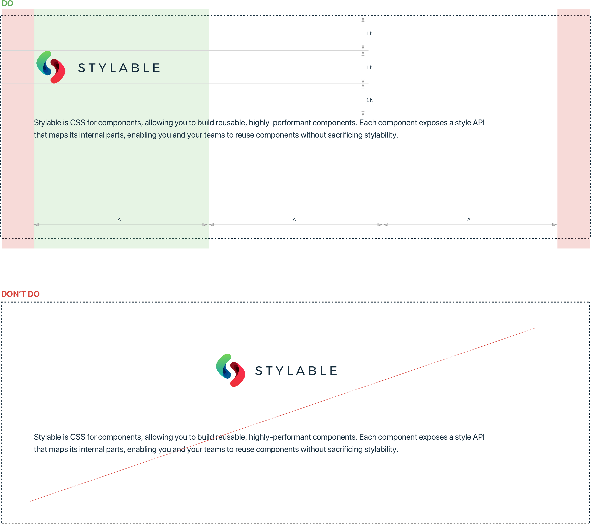
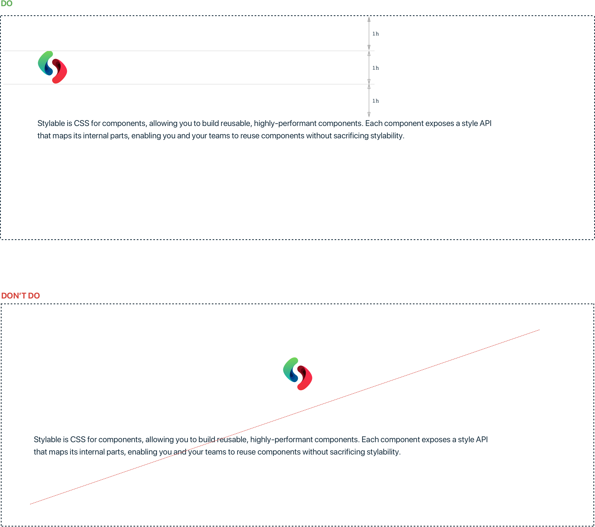

# Stylable Design Language

Logotype
-------------

#### Sizes
Logo available in two sizes: Extra Small (16) for browser tab and Medium(96) for most common use.

#### Types

#### Clear Space and Aligning

The Stylabel's logo is always surrounded by a minimum clear space area. The minimum Clear Space area is equal to the height of the logotype.

##### Vertical Logo Usage

**Aligning:** Middle

##### Horizontal Logo Usage

**Aligning:** Left

##### 

##### Horizontal Logo Usage – Single line

**Aligning:** Left

##### 

##### Symbol Logo Usage

**Aligning:** Left

### Assets

[Logotype](./logo)
